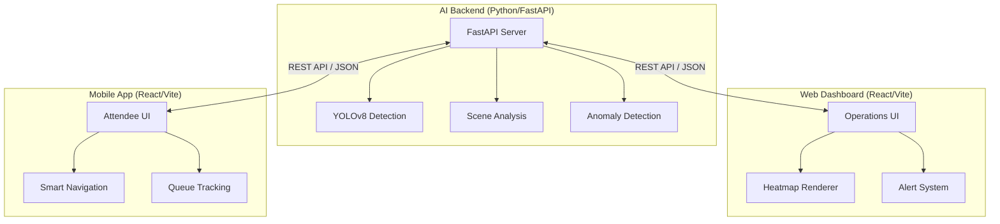

# VenueIQ: Smart Venue Management System


[](https://fastapi.tiangolo.com/)
[](https://reactjs.org/)
[](https://www.typescriptlang.org/)
[](https://www.python.org/)

**VenueIQ** is a comprehensive, AI-driven solution designed to optimize the attendee experience at large-scale sporting venues. By integrating real-time crowd monitoring, predictive analytics, and personalized navigation, it bridges the gap between venue operations and fan satisfaction.

---

## 🏗 Architecture



---

## 🚀 Key Modules & Features

### 1. AI Analytics Backend (`/backend`)

The core intelligence engine providing computer vision inference.

- **Crowd Counting**: Uses YOLOv8 to process camera feeds and return precise person counts.
- **Density Estimation**: Implements logic inspired by CSRNet for high-density area heatmaps.
- **Wait Time Prediction**: Time-series analysis to predict queue lengths at concessions.
- **Safety Anomaly Detection**: Real-time detection of prohibited items or overcrowding.

### 2. Operations Dashboard (`/web`)

A high-level command center for stadium staff.

- **Interactive Stadium Map**: SVG-based visualization with real-time heat coloring.
- **Incident Management**: Automated logging and dispatching for safety alerts.
- **Live Metrics**: Real-time attendance, average wait times, and staff deployment stats.

### 3. Attendee Companion (`/mobile`)

Mobile-optimized experience for fans in the stands.

- **Smart Routing**: Interactive navigation that guides users to their seats while avoiding crowds.
- **Live Queue Status**: See wait times for every food stall and restroom in the venue.
- **Digital Ticketing**: Seamless entry and seat identification.

---

## 📊 Implementation Status

| Feature | Category | Status | Details |
| :--- | :--- | :--- | :--- |
| **Person Detection** | AI | ✅ Complete | YOLOv8n integrated |
| **Wait Time API** | Backend | ✅ Complete | Dynamic simulation logic |
| **Safety Alerts** | Backend | ✅ Complete | YOLOS-Tiny integration |
| **Stadium Heatmap** | Web | ✅ Complete | Real-time SVG rendering |
| **Mobile Navigation** | Mobile | ✅ Complete | Real-time backend routing |
| **Real-time Sync** | System | ✅ Complete | WebSocket alerting active |

---

## 🚦 Getting Started

### Prerequisites

- **Python 3.13+** (with `uv` for management)
- **Node.js 18+**
- **Hardware**: GPU recommended for AI inference (defaults to CPU).

### Installation

1. **Clone the repository**:

   ```bash
   git clone https://github.com/GAURAVSVNIT/venueiq.git
   cd venueiq
   ```

2. **Initialize Backend**:

   ```bash
   cd backend
   uv sync
   python main.py
   ```

3. **Initialize Frontend Modules**:

   ```bash
   # In separate terminals
   cd web && npm install && npm run dev
   cd mobile && npm install && npm run dev
   ```

---

## 🛠 Advanced Configuration

### API Documentation

Once the backend is running, you can explore the full API specification at:

- **Swagger UI**: `http://localhost:8000/docs`
- **ReDoc**: `http://localhost:8000/redoc`

### Environment Variables

Create a `.env` file in the `backend` folder:

```env
MODEL_RELOAD=true
LOG_LEVEL=info
CORS_ORIGINS=*
```

---

## ☁️ Deployment

VenueIQ is configured for seamless deployment on **Google Cloud Platform**.

### Backend (Cloud Run)

The AI backend is containerized and ready for Cloud Run.

1. Create a project on GCP: `venueiq-493915`.
2. Run `gcloud builds submit --tag gcr.io/venueiq-493915/backend` in the `/backend` folder.
3. Deploy via `gcloud run deploy`.

### Frontends (Firebase Hosting)

Both the dashboard and mobile app can be hosted via Firebase Multi-site.

1. Run `firebase target:apply hosting web venueiq-dashboard`.
2. Run `firebase target:apply hosting mobile venueiq-mobile`.
3. Deploy via `firebase deploy --only hosting`.

For a fully automated deployment, run the included script:

```powershell
./deploy.ps1
```

---

## 📄 License

Distributed under the MIT License. See `LICENSE` for more information.
